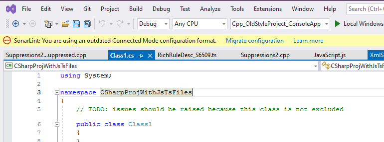

SonarLint for Visual Studio 7.0+ no longer stores the Connected Mode settings files in a location that could be under source control, and no longer modifies C# and VB.NET project files to configure the analysis rules.

This makes binding a solution for the first time much simpler, because no source-controlled files will be modified. However, any solutions that were bound using the old configuration model will need to have their configuration settings migrated to the new model. To help automate the migration process, SonarLint for Visual Studio 7.0 integrates a migration wizard. 

* If you did not customize your binding settings in earlier versions, the wizard should be able to complete the migration without error.
* If you did customize your binding settings, you might need to uncustomize your changes. 

It is recommended to first run the wizard; once completed, SonarLint will announce whether or not the migration was successful. Please check the [instructions below](#if-the-wizard-cannot-make-changes-automatically) about what to do with the wizard logs if there is an error.

# Using the migration wizard

When you open a solution that is bound using the old model, SonarLint will display a notification in Visual Studio and offer an option to open a wizard to help with migration.

Before starting the wizard, it is **_highly recommended_** that you begin in a clean state. For example, you should have no unsaved files, and no uncommitted changes to files under source control before starting the migration.

Select **Migrate configuration** to start the Connected Mode migration wizard. The wizard will do the following:

* Delete the existing .sonarlint settings folder.
    * Note: this may cause source control changes.

* Write the settings files in the new location.

In addition, **_for C# and VB.NET projects only_**, the migration wizard will attempt to do the following:

* Remove any <AdditionalFiles> entries that point to the SonarLint-generated SonarLint.xml file.

* Remove any <CodeAnalysisRuleSet> MSBuild properties that point to the SonarLint-generated ruleset.

SonarLint will attempt to remove these settings from the project files themselves, and also from any .props or .targets files it finds.

SonarLint will announce whether or not the migration was successful. If SonarLint cannot remove all of the settings automatically, it will do its best to identify any changes that must be made manually.

If your code is under source control, you can review the diff after the wizard has finished and see what was changed. Once complete, commiting the change to source control will complete the migration process.

# If the wizard cannot make changes automatically

If the wizard cannot make changes automatically, use the logs to identify which what was missed. Then, manually locate and remove the setting. 

To manually remove the setting, you will need to:

1. delete the .sonarlint folder, and
1. remove the relevant settings from C# and VB.NET project files. See this page for more information about the settings that need to be removed.

Once complete, commit the change to source control to complete the process.

If you have problems with the migration, please open a thread in the [Visual Studio Community Forum](https://community.sonarsource.com/tags/c/sl/visual-studio/35/connected_mode) and tag it with the tags `connected_mode` and `migration`.